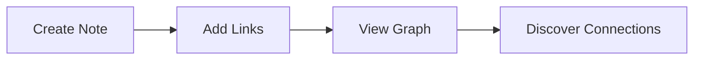

- [x] 正文
- [x] 标题（最好只到3级）
- [x] 表格
- [x] 代码块
- [x] TODO方块头
- [x] 圆圈头
- [x] 引言
- [x] emoji
- [x] 引用块

- [ ] latex 失败
- [ ] mermaid 失败
- [ ] xxxx


# test1
## test2
### test3
#### test4
###### test5
这只是用来测试的
just for test

```
printf("Hello, world");
```

$\alpha \times \beta = \epsilon + \frac{x}{2} +x_2^3$


| Header 1 | Header 2 | Header 3 | Header 4 | Header 5 | Header 6 | 
|----------|----------|----------|----------|----------|----------|
| Cell 1   | Cell 2   | Cell 3   |Cell 4   | Cell 5   | Cell 6   |
| Cell 1   | Cell 2   | Cell 3   |Cell 4   | Cell 5   | Cell 6   |


## Details

中文

> hello
> world
< like>
112233

- [ ] xxxx
- [ ] yyy


### Hello

- hello
- world

---
*Note created in: Root*


## Mermaid Diagrams




## 🗂️ Notes


over
